# Data Analysis Portfolio

# Project 1

**Title:** [Executive Pulse Dashboard – End‑to‑End E‑Commerce BI & Churn Prediction](https://osasere28.shinyapps.io/executive-pulse-dashboard/)

**Tools Used:** R, Shiny, shinydashboard, plotly, DT, tidyverse, lubridate, scales, rsample, yardstick

**Project Description:** A full‑stack business intelligence dashboard built for a Brazilian e‑commerce platform. It ingests over 740,000 transactions (24 features) and presents four integrated tabs:
• Executive Summary – KPI cards (Revenue, Profit, AOV, Active Customers) and Monthly Recurring Revenue trend.
• Customer Segmentation – RFM analysis grouping customers into Champions, Loyal, At Risk, Hibernating, etc., with interactive scatter and box plots.
• Cohort Retention – Heatmap showing month‑by‑month customer retention after first purchase.
• Churn Prediction – Live logistic regression calculator where marketing teams input customer behaviour to instantly see churn probability (colour‑coded gauge) along with model accuracy/AUC.

**Key Findings:** 

The “At Risk” segment represents a large, reclaimable revenue pool; targeted win‑back campaigns could recover significant income.
• Cohort retention drops sharply after the first month – the business should invest in onboarding and early‑life engagement.
• Recency (days since last purchase) is the number‑one driver of churn; customers inactive for >30 days have a much higher churn probability.
• The interactive churn calculator democratises the predictive model – non‑technical stakeholders can use it to trigger real‑time retention actions.

**Dashboard Overview:**

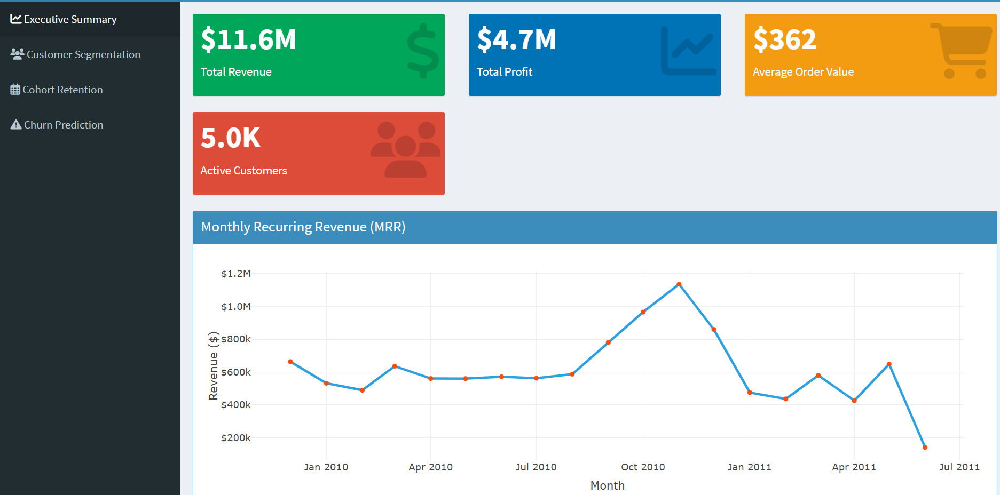

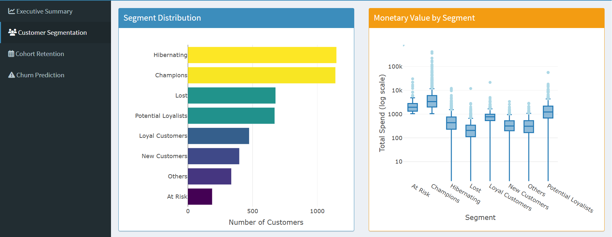

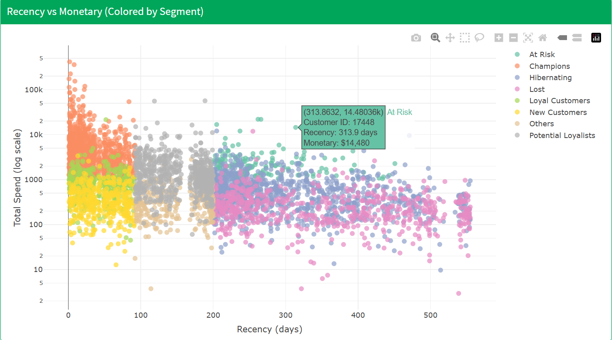

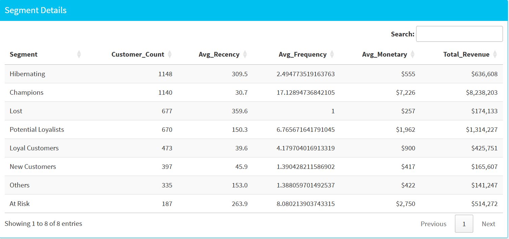

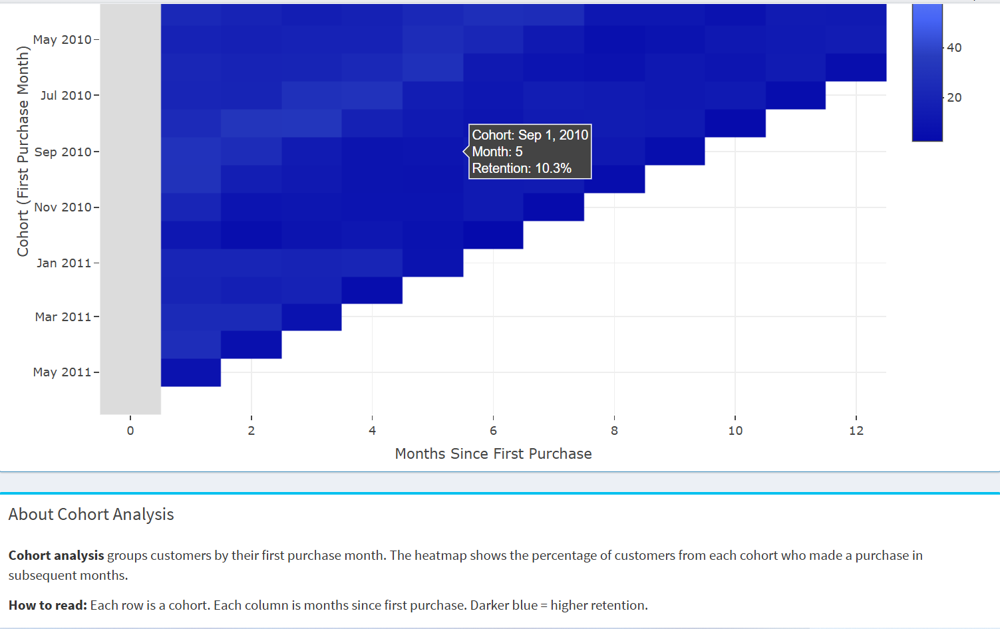

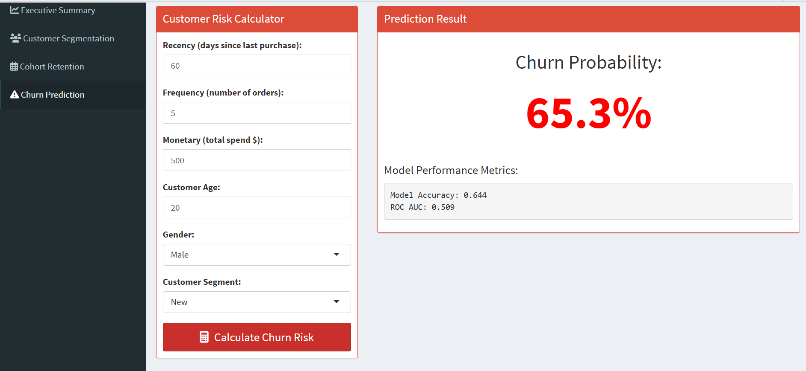

# Project 2

**Title:** [Patient Risk Factor Dashboard – Predictive Analytics in Healthcare](https://osasere28.shinyapps.io/healthcare-risk-dashboard/)

**Tools Used:** R, Shiny, shinydashboard, tidyverse, survival, survminer, ggplot2

**Project Description:** An interactive clinical decision-support tool that predicts a patient’s probability of death during hospitalisation. The dashboard combines a logistic regression model (GLM) with Cox proportional hazards survival analysis and Kaplan-Meier curves. Clinicians can adjust patient age and length‑of‑stay via sliders to instantly see the predicted mortality risk (colour‑coded from green to red) and a personalised survival curve. The underlying models are trained on simulated hospital admission data, demonstrating how advanced statistics can be made accessible to non‑technical medical staff.

**Key Findings:**

• Each additional day in the hospital increases the odds of death by ~13% (odds ratio ≈ 1.14).
• Length of stay is a stronger predictor of mortality than age alone.
• Older age groups (70+) show a significantly steeper decline in survival probability after 10–15 days.
• The built‑in risk gauge translates complex model output into an intuitive “low/medium/high risk” alert, supporting rapid triage decisions.

**Dashboard Overview:**

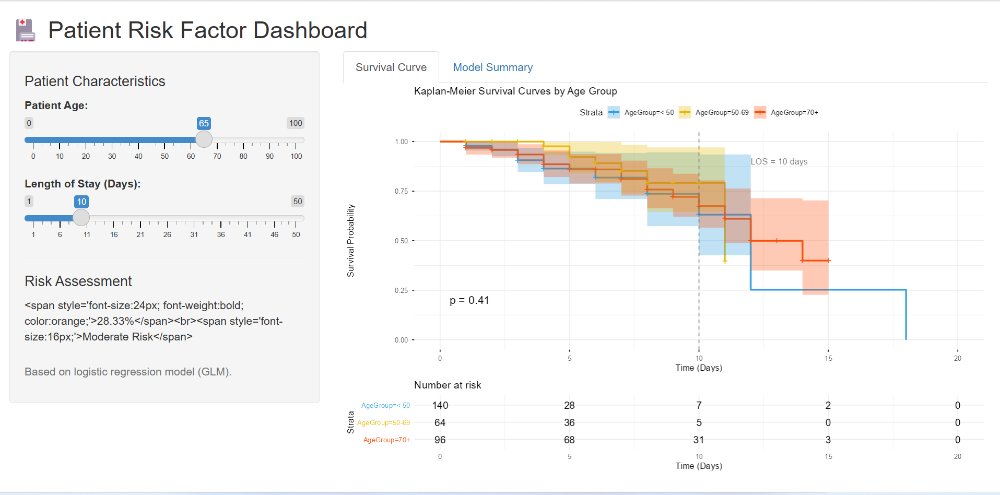

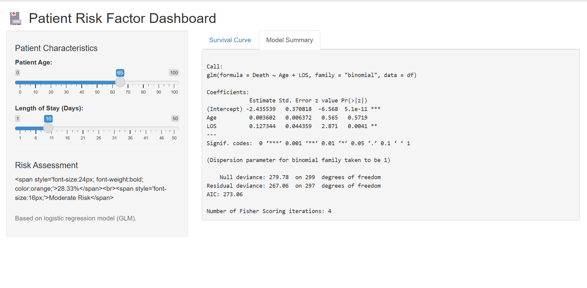

# Project 3

**Title:** [Brazilian E-Commerce Delivery Performance Analysis](https://github.com/Osasere-David/data-science/blob/main/data/week1_analysis.ipynb)

**Python Skills Used:**

- Python fundamentals: variables, data types, loops, dictionaries, and list comprehensions
- NumPy for array operations and broadcasting
- Pandas for data loading, cleaning, merging, and transformation
- Datetime conversion and feature engineering
- SQL with SQLite for database storage and analysis
- Aggregate analysis using GROUP BY and conditional calculations
- Data visualization with Matplotlib and Seaborn
- Basic file handling and working with local directories

**Project Description:**

This project analyzed Brazilian e-commerce order data to measure delivery performance across states. I loaded separate orders and customer datasets, merged them into a single DataFrame, cleaned and transformed the data, converted timestamp fields into datetime format, and created a delivery status flag. I then stored the cleaned dataset in SQLite and used SQL queries to calculate delivery success rates by state. Finally, I visualized the results in a styled horizontal bar chart to highlight the top and bottom performing states.

**Technology Used:** VS Code, Python, Pandas, NumPy, SQLite3, SQL, Matplotlib, Seaborn

**Python Code:**

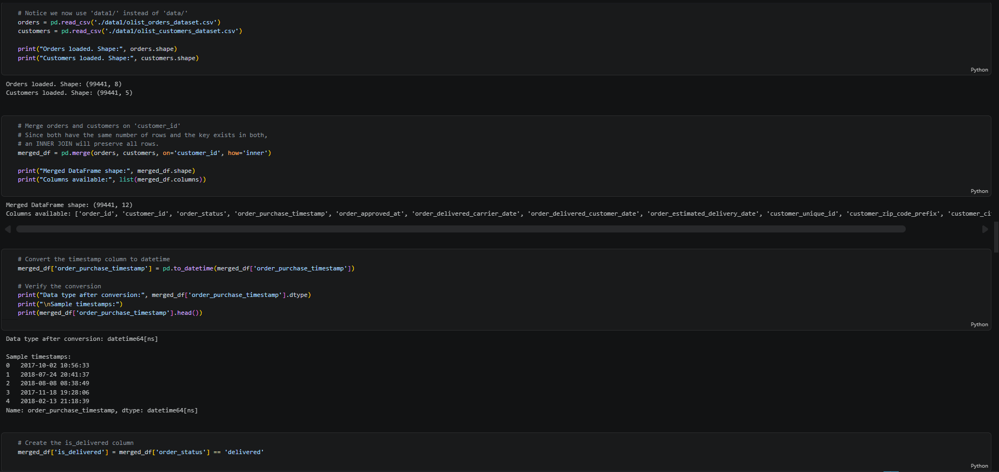

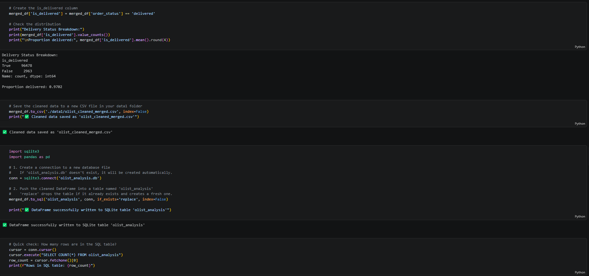

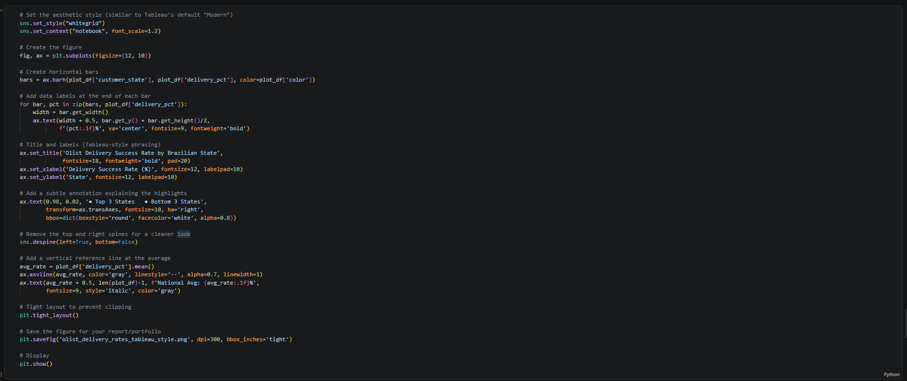

# Project 4

**Title:** [Bank Loan Report](https://github.com/Osasere-David/Osasere-David.github.io/blob/main/Loan%20Dashboard.pbix)

**Tools Used:** Powerbi (Power Query, Data Modeling, DAX, Visualizations, Page Navigator)

**Project Description:** Designed and built an interactive Power BI dashboard to analyze loan performance and portfolio health across multiple categories. Utilized Power Query for data transformation, data modeling for relationship management, and DAX measures to calculate key financial metrics such as Total Funded Amount, Amount Received, Average Interest Rate, and Debt-to-Income (DTI).
The dashboard provides both high-level KPIs and detailed loan-level insights, comparing Good vs. Bad Loans and tracking Month-to-Date (MTD) and Month-over-Month (MoM) performance. Delivered actionable insights showing that 86.2% of loans were good, with a 13% MoM growth in funding and 15.8% MoM growth in repayment, helping stakeholders monitor loan quality and optimize lending strategies.

Scope:

   ~ Evaluate loan performance by purpose, ownership, term, and customer demographics.

   ~ Measure financial health using MoM and MTD comparisons.

   ~ Enable quick identification of trends in good vs. bad loans.

   ~ Provide detailed transaction-level insights.

Dashboard Pages:

   Summary: Overall KPIs, Good vs. Bad Loan breakdown, and loan performance by status.

   Overview: Visual analysis by loan purpose, term, employee length, and ownership.

   Details: Transaction-level dataset view for operational analysis.

**Key Findings:** 

 **1. Loan Performance Summary**

   Total Applications: 38.6K

   Total Funded Amount: $435.8M

   Total Amount Received: $473.1M

   Average Interest Rate: 12.0%

   Average DTI: 13.3%

 **2. Good vs. Bad Loans**

   Good Loans: 86.2% (33.2K applications)

   Funded: $370.2M | Received: $435.8M

   Bad Loans: 13.8% (5.3K applications)

   Funded: $65.5M | Received: $37.3M

   → Indicates strong portfolio performance, with the majority of loans performing well.

 **3. Loan Status**

   Fully Paid: $351.4M funded, $411.6M received

   Charged Off: $65.5M funded, $37.3M received

   Current Loans: $18.9M funded, $24.2M received

   → Portfolio shows positive recovery, though charged-off loans still significant.

 **4. Term Analysis**

   36-month loans: 62.3% ($295M)

   60-month loans: 37.7% ($178M)

   → Shorter-term loans are preferred and perform better.
   
 **5. Trends and MoM Insights**

   MTD Funded Amount: $54M
  
   MoM Growth: 13% increase in funding and 15.8% increase in amount received.
  
  → Suggest upward trend in loan issuance and repayment.

 **6. Loan Purpose Breakdown** 

   Top Purpose: Debt Consolidation($250M+ received)
  
   Followedby Credit Card, Home Improvement, and Small Business loans.
  
  → Debt-related loans dominate the portfolio
   
  
 **7. Home Ownership**

   Mortgage Holders: $238M received

   Renters: $202M received

   → Mortgage-backed loans are more reliable in returns.

**In Summary**

   This Loan Performance Dashboard effectively tracks the financial health of a loan portfolio. It highlights:

   Strong repayment and low default trends.

   Majority of loans concentrated in debt consolidation and short-term durations.

   Opportunities to further optimize lending for renters and longer-term loans.
   
 **Recommendation**

   ~ Tighten risk controls for long-term and high-interest loans, which show higher default (bad loan) rates.

   ~ Promote shorter-term products (36 months)—they demonstrate better repayment performance and lower DTI.

   ~ Expand the debt consolidation segment—it’s the most profitable and reliable category.

   ~ Launch customer loyalty or refinancing programs for high-performing borrowers to maintain repayment momentum.

   ~ Leverage MoM growth data to forecast funding needs and plan liquidity management proactively.

**Dashboard Overview:**
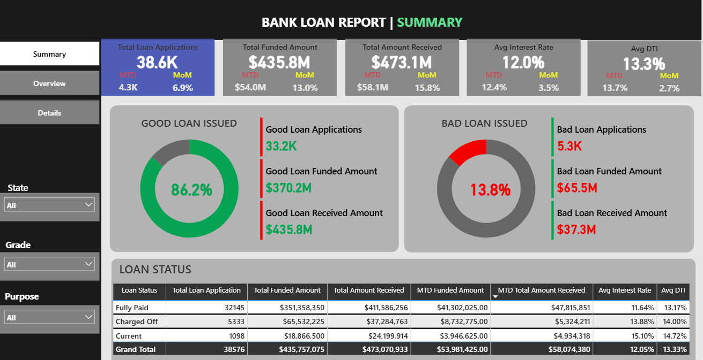

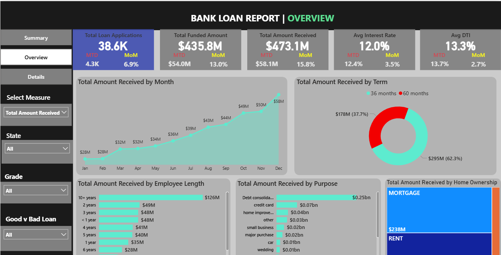

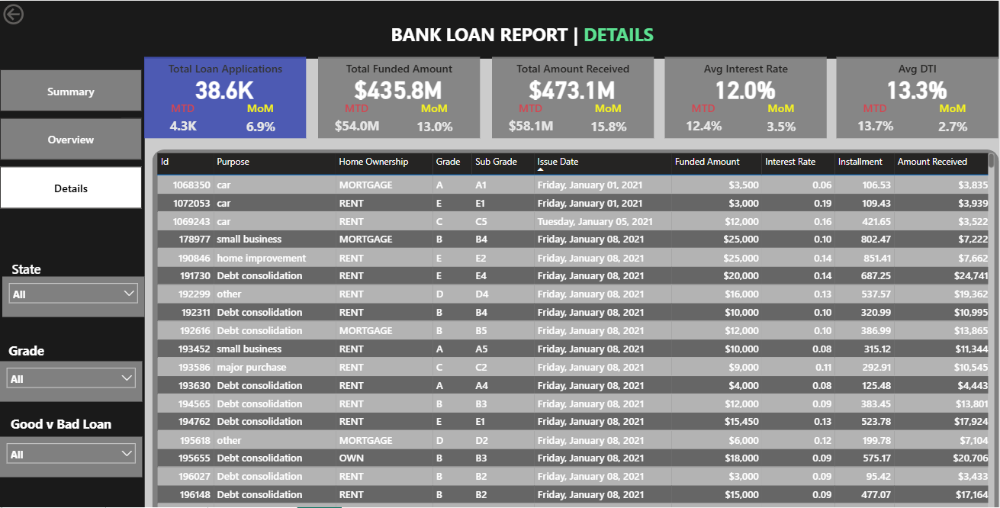

# Project 5

**Title:** [ATM Transaction Analysis](https://github.com/Osasere-David/Osasere-David.github.io/blob/main/ATM%20Dashboard.pbix)

**Tools Used:** Powerbi(Power Query, Data Modeling, DAX, Visualizations, Conditional Formatting)

**Project Description:** Developed a comprehensive Power BI dashboard to monitor ATM network performance across multiple states, analyzing transaction activity, uptime, maintenance costs, and profitability. Leveraged Power Query for data transformation, DAX measures for financial KPIs (revenue, gross profit %, uptime), and interactive visuals for month-over-month trend analysis.
The dashboard provides insights into margin distribution, transaction volume, and regional performance, enabling management to identify underperforming ATMs and optimize maintenance operations. Achieved a clear view of 91.9% average uptime, 59.6% gross profit margin, and highlighted key regional performance variations for operational improvement.

Scope:

   ~ Track monthly financial and non-financial transactions.

   ~ Assess total and average monthly revenue per ATM.

   ~ Evaluate operational efficiency through uptime and gross profit metrics.

   ~ Analyze ATM maintenance costs (AMC, VSAT, Site Maintenance, UPS).

   ~ Compare regional and month-over-month performance.

Dashboard Pages:

   1. Overview: Visualization of transaction and revenue trends by region and month.

   2. Details: ATM-level breakdown for detailed performance monitoring and profitability analysis.

**Key Findings:** 

 **1. Overall Performance Summary**

   Total Cost: 296M

   Avg Monthly Transactions: 5.46K

   Avg Monthly Revenue: 52.13K

   Avg Uptime: 91.9%

   Gross Profit %: 59.6%
   → Indicates strong operational efficiency and healthy profitability across the ATM network.

 **2. Revenue and Cost Breakdown**

   ATM Revenue Total: 616M

   MHA (Managed Service Provider) Revenue: 575M
   → MHA contributes the bulk of total revenue, showing its strategic importance.

   Service cost components include ATM AMC, Site Maintenance, UPS AMC, and VSAT AMC.

 **3. Monthly Trends**

   Steady growth observed in monthly revenue and transaction counts through 2024.

   Both financial and non-financial transactions (like balance inquiries) are tracked — with financial transactions being the dominant driver of revenue.

   Visuals indicate consistent performance across key months (Mar–Aug–Nov–Dec).

 **4. Margin and Transaction Range Analysis**

   Margin Distribution:→ Majority of ATMs (over 2,300) achieve above 30% profit margin, indicating highly efficient operations.
   Transaction Range (Previous Month):→ About 1,300+ ATMs had more than 200 transactions, signaling strong usage across the network.

 **5. 5. Regional Performance**

   → High profitability and uptime in Mizoram (100%) and Ladakh (93.8%), while Nagaland shows lower uptime (68.8%) despite strong margins.
   → Punjab and Assam are key states with large ATM volumes.
   
 **In Summary**
 
   This ATM Transactional Dashboard provides comprehensive insights into revenue, costs, and operationa efficiency.
   
   Key takeaways: ~  Maintenance cost are well controlled relative to revenue.
~ Most ATMs fall within the above 30% margin range, reflecting effective management.
~ The ATM Network maintains high uptime (92%) and strong profitability (60% margin).
~  Regional focus could be placed on Nagaland and Meghalaya for uptime improvements.

 **Recommendations:**

   ~ Investigate underperforming regions (Nagaland, Meghalaya, etc) and improve maintenance or connectivity to boost uptime.

   ~ Increase transaction incentives (cashback, offers) in low-traffic areas to improve utilization.

   ~ Optimize maintenance contracts (AMC, VSAT) based on cost-to-revenue ratios to maintain profitability.

   ~ Deploy predictive maintenance analytics to preempt downtimes and sustain the >90% uptime target.

   ~ Expand ATM footprint in high-margin zones to leverage strong performance and customer engagement.

 
**Dashboard Overview:**

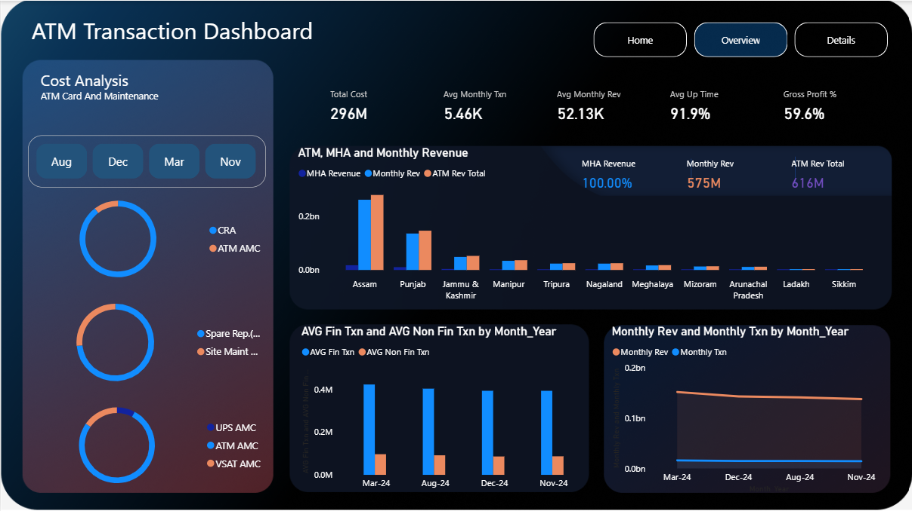

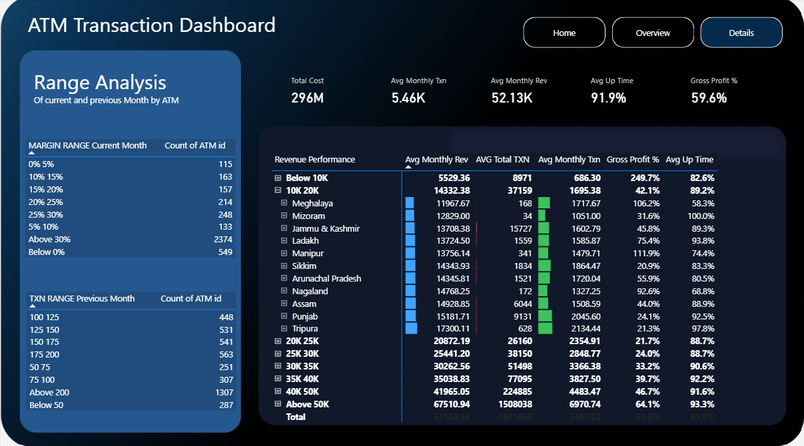

# Project 6

**Title:** [Shopify Sales And Customers Report](https://github.com/Osasere-David/Osasere-David.github.io/blob/main/Shopify%20Dashboard.pbix)

**Tools Used:** Powerbi(Power Query, Data Modelling, DAX, Visualization, Page Design)

**Project Description:**  Developed an interactive Shopify sales analytics dashboard in Power BI to track e-commerce KPIs including Net Sales ($4.18M), Average Order Value ($562), and Customer Lifetime Value ($943). Applied Power Query for data transformation, DAX for retention and profitability calculations, and visual storytelling for funnel and regional insights.
The dashboard highlights customer purchase behavior, payment gateway performance, and top-selling product categories—enabling data-driven marketing and retention strategies with a 46% repeat customer rate and strong regional sales visibility.
Scope:

   ~ Track daily, hourly, and city-level sales performance.

   ~ Analyze customer retention, repeat purchase rate, and lifetime value.
     
   ~ Compare sales channels (Shopify Payments, PayPal, Gift Cards, Amazon Pay).

   ~ Identify top-selling product categories and regional revenue hotspots.

   ~ Enable decision-making around marketing, pricing, and customer engagement strategies.

**Key Findings:** 

 **1. Overall Performance**

   Total Quantity Sold: 7,534

   Net Avg Order Value: $562.6

   Total Customers: 4,431

   Single Order Customers: 2,392

   Repeat Customers: 2,039

   Repeat Rate: 46%

   Purchase Frequency: 1.68

   Lifetime Value (LTV): $943.6
   
   Net Sales: $4,180,874

   ➡️ Strong repeat customer base (nearly half of all buyers), suggesting successful retention and engagement.

 **2. Sales Channel Analysis**

   Shopify Payments: $2.44M (58.4%)

   PayPal: $736.9K (17.6%)

   Gift Cards: $681.2K (16.3%)

   Amazon Payments: $236.6K (5.7%)

   ➡️ Majority of transactions flow through Shopify Payments, but alternative gateways (PayPal, Gift Cards) contribute meaningfully to total sales.

 **3. Product Performance**

   Top Product Categories:

   Running Shoes – $1.5M

   Tennis Shoes – $0.9M

   Walking Shoes – $0.6M

   Cycling & Climbing Shoes – $0.5M each

   Sandals and Flip-flops – $0.1M range

   ➡️ Shoe-related products dominate sales (~85%+ of total revenue), with potential to expand into apparel and accessories.

 **4. Regional & Time Analysis**

   Top Cities by Net Sales: New York, Houston, Dallas, Miami, Los Angeles, Chicago.

   Hourly Sales Trends: Consistent activity during mid-day hours; lower overnight sales.

   Daily Sales Trends: Highest sales on the 19th–22nd, averaging over $640K per day.

   Province/Country Trends: Strong revenue concentration in major U.S. urban centers.

   ➡️ Identifies high-value regions and peak activity hours, useful for targeted ad campaigns and fulfillment planning.

**In Summary**

   This Power BI Shopify Dashboard provides a comprehensive e-commerce performance overview, connecting sales data with customer behavior to reveal patterns in revenue,       retention, and product demand.
   It helps decision-makers monitor key funnel metrics—from order frequency to repeat rates—and optimize marketing strategies to enhance customer lifetime value and           profitability.
   
 **Recommendations:**
 
   ~ Invest in customer retention campaigns—a 46% repeat rate is strong; focus on loyalty rewards and personalized offers to reach 60%+.

   ~ Expand marketing spend on top-performing cities (New York, Houston, Dallas) and replicate successful regional campaigns.

   ~ Diversify product catalog—high dependence on footwear presents concentration risk. Introduce apparel or accessories to broaden revenue base.

   ~ Monitor payment gateway fees—encourage Shopify Payments (lower fees) while retaining flexibility with PayPal/Amazon Pay.

   ~ Leverage sales time analysis to schedule promotions during peak activity hours for maximum ROI.

**Dashboard Overview:**

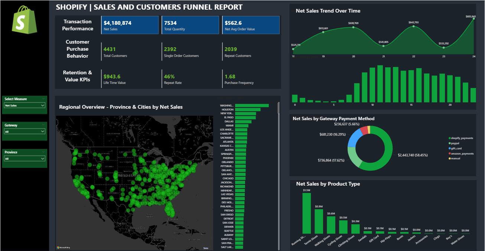

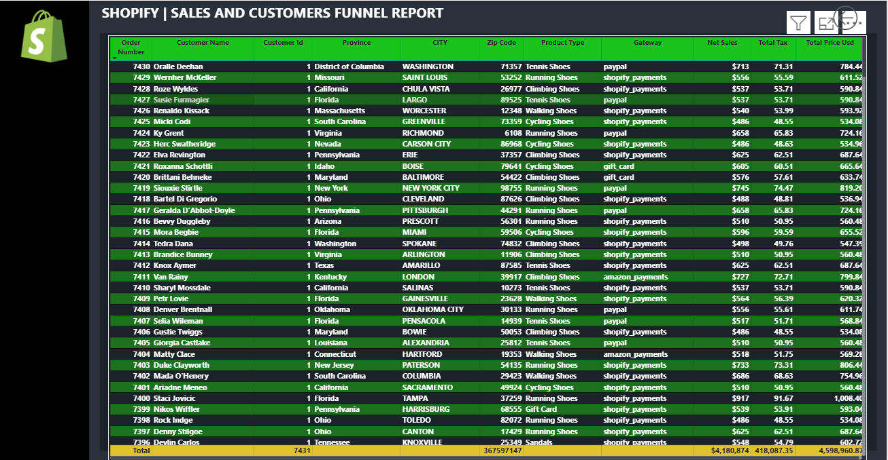

# Project 7

**Title:** Workplace Safety Data Insight - Data Manipulation and Interrogation

**SQL Code:** [Workplace Safety Incident Analysis](SafetyData-File.sql)

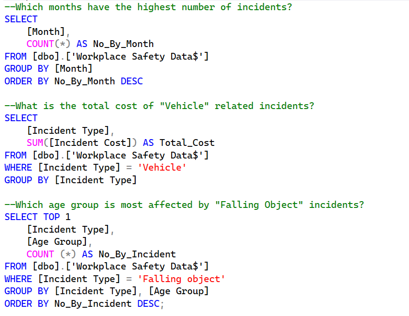

**SQL Skills Used:** 

   ~ Data Retrieval (SELECT): Queried and extracted specific information from the database.

   ~ Data Aggregation (SUM,AVG,COUNT): Calculated totals, averages, and counted records to analyze data trends.

   ~ Data Filtering (WHERE): Applied filters to select relevant data needed for analyzing.

   ~ Data Source Specification(FROM): Specified the tables used as data soruces for retrieval

**Project Description:** Developed a comprehensive SQL-based analytics project to explore and evaluate workplace safety performance using (SQL Server).
Implemented multiple analytical queries to identify incident frequency, cost distribution, risk patterns, and demographic impacts across plants, departments, and time periods.
Used advanced SQL functions (GROUP BY, AVG, CASE, TOP) to uncover trends such as high-risk locations, costly incident types, and age/shift-based exposure, supporting data-driven safety management decisions.

Scope:
This project uses SQL queries to perform data exploration and analysis on workplace safety records stored in a relational database. The dataset includes columns such as Plant, Department, Incident Type, Injury Location, Days Lost, Age Group, Gender, Report Type, and Incident Cost.

Key analytical tasks include:

   ~ Counting incidents by plant, department, and year to identify high-risk locations.

   ~ Calculating total and average incident costs by department, injury location, and report type.

   ~ Evaluating incident severity using days lost and cost metrics.

   ~ Analyzing incident patterns by shift, gender, and age group.

   ~ Detecting recurring incident types such as “Crush & Pinch” and “Falling Object.”

   ~ Assessing temporal trends (month/year analysis) to identify seasonal spikes.

**Technology Used:** SQL Server

# Project 8

**Title:** Customer Insight - Data Manipulation and Interrogation

**SQL Code** [Customer Insight](sqlnumbertwo.sql)

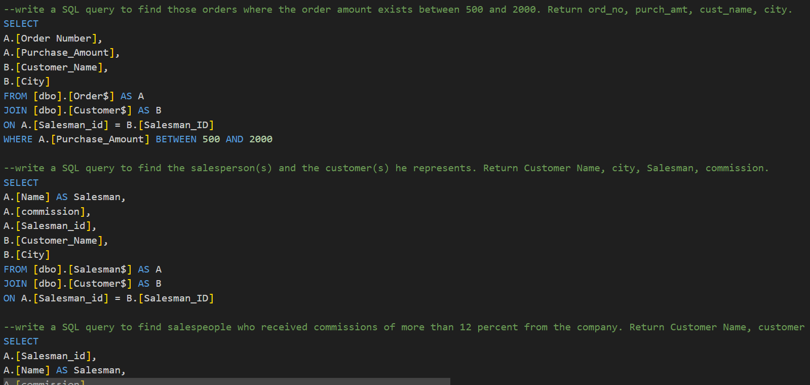

**SQL Skills Used:** Data Retrieval (SELECT): Queried and extracted specific information from the database.
Data Aggregation (SUM, COUNT): Calculated totals, such as sales and quantities, and counted records to analyze data trends.
Data Filtering (WHERE, BETWEEN, IN, AND): Applied filters to select relevant data, including filtering by ranges and lists.
Data Source Specification (FROM): Specified the tables used as data sources for retrieval.

**Project Description:** 
Designed and executed a series of SQL queries to analyze workplace safety incidents, costs, and patterns across multiple relational tables including Customers, Orders, and Salesman. Utilized data retrieval (SELECT) to extract specific records, data aggregation (SUM, COUNT) to calculate total incidents and costs, and data filtering (WHERE, BETWEEN, IN, AND) to isolate relevant conditions such as time periods, incident types, and report categories.
The project involved building reports that combined customer demographics, order details, purchase amounts, and salesman performance to understand sales trends and customer behaviour. Queries were designed to:

   ~ Retrieve customer and order information, including city, order date, and purchase amount.

   ~ Analyze orders by status to evaluate fulfilment efficiency.

   ~ Identify customers without assigned sales representatives for potential sales opportunities.

   ~ Join salesmen and customer data to analyse commission structures and their impact on sales.

   ~ Aggregate purchase amounts and order counts to assess overall sales performance across regions and time periods.

Through this data interrogation, the project highlighted patterns in customer purchases, identified gaps in sales coverage, and provided insights into improving sales strategies.

**Technology Used:** SQLServer

# Project 9

**Title:** [King Inc Sales And Profit Analysis](https://github.com/Osasere-David/Osasere-David.github.io/blob/main/Sales%20and%20Profit%20Data%20Dashboard.xlsx)

**Tools Used:** Data Preparation and Cleaning, Microsoft Excel(Pivot Table and Pivot Charts, Excel formulas and Named Ranges, Slicers, Interactive charts, Data Labels, Conditional Formatting, KPIs, Dynamic filter)

**Project Description:** Created an interactive Excel dashboard to track multi-year sales and profit trends, integrating Pivot Tables, Slicers, and Dynamic Charts. The dashboard visualizes key KPIs including Total Sales ($1.93M) and Profit ($247.9K), along with category, regional, and customer-level insights.
Enabled data-driven decision-making through visual analysis of top-performing states, seasonal trends, and high-profit customers, highlighting growth patterns and sales opportunities across 2021–2024.

 Scope:

   ~ Track Total Sales ($1.93M) and Total Profit ($247.96K) over 2021–2024.

   ~ Compare yearly profit growth and category-wise contributions.

   ~ Identify top-performing customers and regions.

   ~ Visualize sales distribution across states and months.

   ~ Support decision-making through interactive filters and dynamic visual elements.

**Key Findings:**
 **1. Overall Performance**

   Total Sales: $1,928,888

   Total Profit: $247,962

   Profit trend shows steady growth from 2021 to 2024, with 2024 marking the highest profit period.

 **2. Yearly Profit Trends**
   Year	Profit
   2021	$35,053
   2022	$21,493
   2023	$33,504
   2024	$39,774

   ➡️ Profit increased overall, with a temporary dip in 2022. The upward trend resumed, showing consistent performance improvement.

 **3. Category-Wise Performance**

   Top Categories by Sales:

   Technology

   Office Supplies

   Furniture

   Top Products by Profit:

   Phones, Chairs, Storage, Binders, Tables, Machines.

   ➡️ Technology products contribute the most to total sales and profit, followed by Office Supplies.

 **4. Top Customers**

   Top 5 Customers by Profit:

   Martinez

   Adrian Barton

   Sanjit Chand

   Raymond Buch

   Tamara Chand

   ➡️ Indicates strong recurring business from key clients, valuable for retention and upselling strategies.

 **5. Geographic and Temporal Insights**

   Sales by State:
   High-performing regions include California, Texas, New York, and Florida, each generating over $150K in sales.

   Sales by Month:
   Sales peak during October–December, indicating a strong Q4 performance likely due to seasonal demand.

   Customer Count:
   Increasing annually, suggesting healthy business growth and customer acquisition.

**In Summary**

   This Excel dashboard provides a comprehensive view of sales and profitability performance across multiple dimensions — year, category, region, and customer.
   It enables management to:

   Track yearly growth trends,

   Identify top customers and categories,

   Pinpoint high-performing states and seasonal sales trends, and

   Optimize sales strategy for profitability improvement.
   
 **Recommendations:**

   ~ Strengthen relationships with top customers through loyalty incentives or dedicated account management.

   ~ Focus on Q4 inventory optimization to maximize profits during seasonal peaks.

   ~ Reassess low-profit categories (e.g., Paper, Supplies) to reduce or reprice low-margin SKUs.

   ~ Enhance marketing around Technology products, which consistently outperform.

   ~ Expand sales outreach in states with moderate sales but high growth potential to balance regional performance.

**Dashboard Overview:**

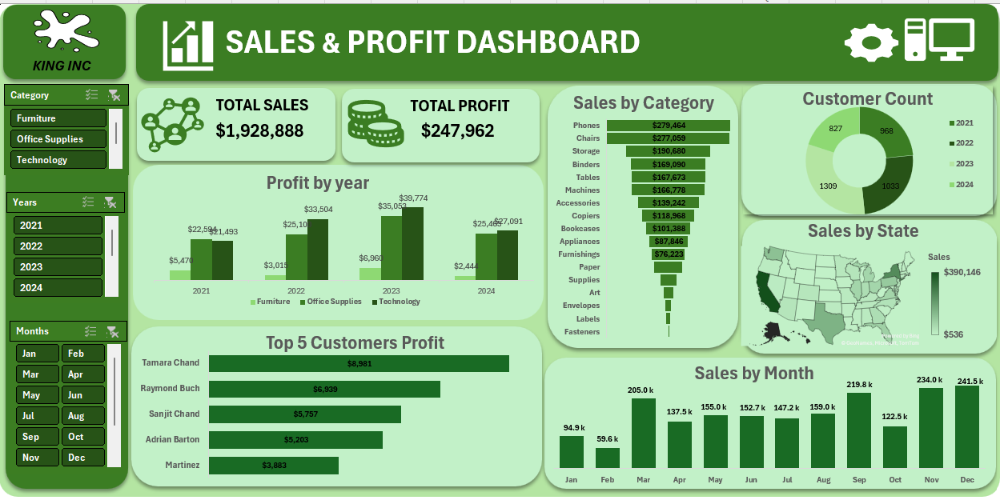

# Project 10

**Title:** [Superstore Sales Analysis](https://github.com/Osasere-David/Osasere-David.github.io/blob/main/superstore-sales-dataset-%20Dashboard%202.xlsx)

**Tools Used:** Data Prepaation and Transformation, Microsoft Excel(Pivot Tables and Pivot Chart)

**Project Description:** Developed an interactive Excel dashboard to analyze retail sales and profitability trends across four years. Utilized Pivot Tables, Slicers, and Dynamic Charts to visualize KPIs including Total Sales ($2.3M), Profit ($286K), and Profit Margin (12.47%).
The dashboard highlights Consumer and Technology as top-performing segments, identifies seasonal spikes in Q4, and provides regional insights for better sales strategy and inventory management.
 Scope:

   ~ Track total sales and profits by year, month, and category.

   ~ Identify top-performing customer segments and product types.

   ~ Measure profitability percentage and yearly growth.

   ~ Filter results dynamically by Region and Segment.

**Key Findings:**

 **1. Overall Performance**

   Total Sales: $2,297,201

   Total Profit: $286,397

   Profit Margin: 12.47%
   → Strong profitability indicating efficient cost management and healthy margins.

 **2. Yearly Trends**
   Year	Sales	Observation
   2011	$484,247	Stable start year
   2012	$470,533	Slight dip in sales
   2013	$608,474	Noticeable recovery
   2014	$733,947	Highest growth year

   ➡️ Consistent year-over-year growth, with sales peaking in 2014 (51% increase from 2012).

 **3. Monthly Sales Trends**

   Sales peak during October–December, with November and December showing the highest spikes (above $5,000 monthly).

   Lowest sales observed in January and February, typical of post-holiday slowdowns.

   ➡️ Indicates strong Q4 performance—ideal for promotional or inventory focus.

 **4. Customer and Category Insights**

   Top Customer Segment: Consumer

   Top Category: Technology

   Top-selling Subcategories: Phones, Machines, and Accessories.

   Categories like Supplies and Labels have low sales volume.

   ➡️ Focused sales strategy on Technology and Consumer segments could further drive profitability.

 **5. Regional and Shipping Insights**

   Dashboard includes filters for Central, East, South, and West regions.

   Ship Modes: First Class, Same Day, Second Class, Standard Class — allowing logistical performance tracking.

   Likely regional variance in demand, with West and East regions showing higher sales volumes.

**In Summary**

   This Excel dashboard efficiently summarizes Superstore sales performance (2011–2014), providing clear insight into profitability, sales trends, and customer behavior.
   It enables business users to:

   Track multi-year growth,

   Identify profitable segments and categories, and

   Align marketing or logistics strategies to seasonal and regional demand patterns.
     
**Recommendations:**

   ~ Prioritize Technology and Consumer-focused marketing—they are driving the highest margins.

   ~ Capitalize on Q4 demand with early promotional campaigns in Q3 to capture pre-holiday sales.

   ~ Evaluate underperforming categories (Supplies, Labels, Art) for potential discontinuation or pricing adjustment.

   ~ Optimize shipping options—“Same Day” and “First Class” might offer higher customer satisfaction but should be cost-monitored.

   ~ Target corporate clients for diversification, as Consumer sales dominate—this reduces dependency on one segment.

**Dashboard Overview:** 

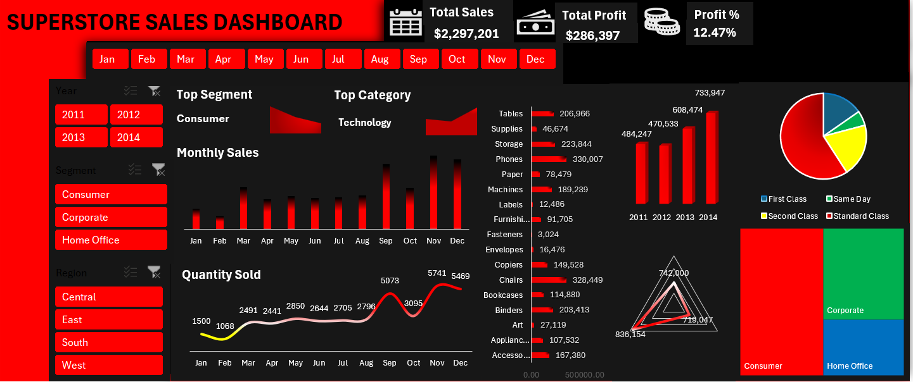

